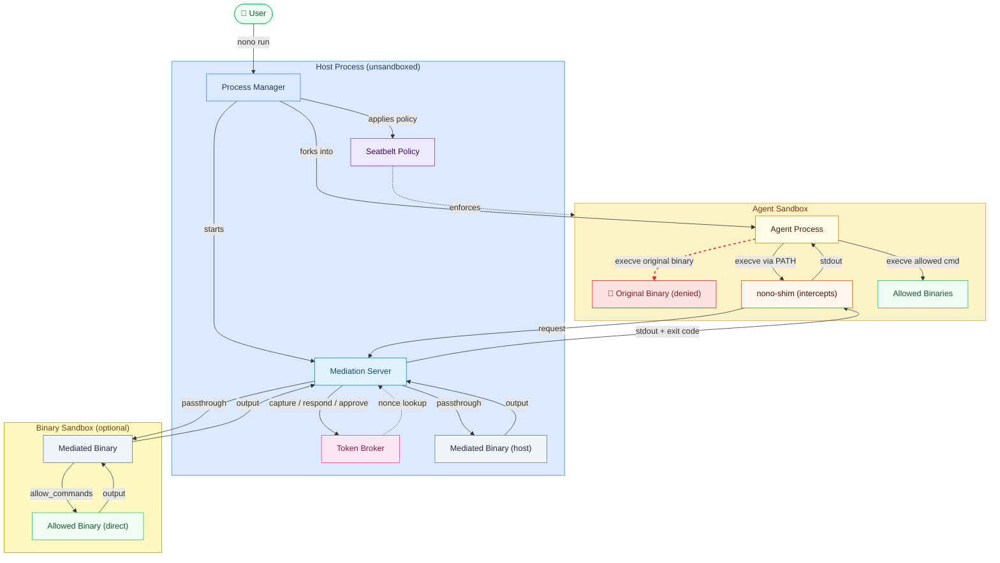

<div align="center">


<p>
  From the creator of
  <a href="https://sigstore.dev"><strong>Sigstore</strong></a>
  <br/>
  <sub>The standard for secure software attestation, used by PyPI, npm, brew, and Maven Central</sub>
</p>
<p>
  <a href="https://opensource.org/licenses/Apache-2.0"></a>
  <a href="https://github.com/always-further/nono/actions/workflows/ci.yml"></a>
  <a href="https://docs.nono.sh"></a>
</p>
<p>
  <a href="https://discord.gg/pPcjYzGvbS">
    
  </a>
   <a href="https://alwaysfurther.ai/careers">
      
  </a>
  <a href="https://github.com/marketplace/actions/agent-sign">
    
  </a>
</p>

---
</div>


<div align="center">


</div>

> [!WARNING]
> Early alpha -- not yet security audited for production use. Active development may cause breakage.


Most sandboxes feel like sandboxes. Rigid, sluggish, and designed for a different problem entirely. nono was built from the ground up for AI agents - and the developer workflows they need to thrive - agent multiplexing, snapshots, credential injection, supply chain security out of the box. Develop alongside nono, then deploy anywhere: CI pipelines, Kubernetes, cloud VMs, microVMs. The one stop shop for all your clankers.

---

## Latest News

- **nono registry** - we will be bringing online a skill and policy registry to allow uses to contribute agent skills (SKILLS.md, hooks, scripts etc), and policy - this will allow us to more easily scale to supporting all of the different agents, installers and linux dists. Security will be baked in from the start. [Read more here](https://github.com/always-further/nono/issues/630)

- **WSL2 support** -- Auto-detection with ~84% feature coverage out of the box. Run `nono setup --check-only` to see what's available. ([#522](https://github.com/always-further/nono/pull/522))

[All updates](https://github.com/always-further/nono/discussions/categories/announcements)

---

**Platform support:** macOS, Linux, and [WSL2](https://nono.sh/docs/cli/internals/wsl2).

**Install:**
```bash
brew install nono
```

Other options in the [Installation Guide](https://docs.nono.sh/cli/getting_started/installation).

---

## Quick Start

Profiles for [Claude Code](https://docs.nono.sh/cli/clients/claude-code), [Codex](https://docs.nono.sh/cli/clients/codex), [OpenCode](https://docs.nono.sh/cli/clients/opencode), [OpenClaw](https://docs.nono.sh/cli/clients/openclaw), and Swival -- or [define your own](https://docs.nono.sh/cli/features/profiles-groups).

## Libraries and Bindings

The core is a Rust library that can be embedded into any application. Policy-free - it applies only what clients explicitly request.

```rust
use nono::{CapabilitySet, Sandbox};

let mut caps = CapabilitySet::new();
caps.allow_read("/data/models")?;
caps.allow_write("/tmp/workspace")?;

Sandbox::apply(&caps)?;  // Irreversible -- kernel-enforced from here on
```

####  Python — [nono-py](https://github.com/always-further/nono-py)

```python
from nono_py import CapabilitySet, AccessMode, apply

caps = CapabilitySet()
caps.allow_path("/data/models", AccessMode.READ)
caps.allow_path("/tmp/workspace", AccessMode.READ_WRITE)

apply(caps)  # Apply CapabilitySet
```

####  TypeScript — [nono-ts](https://github.com/always-further/nono-ts)

```typescript
import { CapabilitySet, AccessMode, apply } from "nono-ts";

const caps = new CapabilitySet();
caps.allowPath("/data/models", AccessMode.Read);
caps.allowPath("/tmp/workspace", AccessMode.ReadWrite);

apply(caps);  // Irreversible — kernel-enforced from here on
```

---

## Features

### Kernel-Enforced Sandbox

nono applies OS-level restrictions that cannot be bypassed or escalated from within the sandboxed process. Permissions are defined as capabilities granted before execution -- once the sandbox is applied, it is irreversible. All child processes inherit the same restrictions.

| Platform | Mechanism | Minimum Kernel |
|----------|-----------|----------------|
| macOS | Seatbelt | 10.5+ |
| Linux | Landlock | 5.13+ |

```bash
# Grant read to src, write to output — everything else is denied by the kernel
nono run --read ./src --write ./output -- cargo build
```

### Credential Injection

Two modes: **proxy injection** keeps credentials entirely outside the sandbox — the agent connects to `localhost` and the proxy injects real API keys into upstream requests. **Env injection** loads secrets from the OS keystore, 1Password, or Apple Passwords and injects them as environment variables before the sandbox locks.

```bash
# Proxy mode — agent never sees the API key, even in its own memory
nono run --network-profile claude-code --proxy-credential openai -- my-agent

# Env mode — simpler, but secret is in the process environment
nono run --env-credential openai_api_key --allow-cwd -- my-agent

# 1Password — map URI reference to destination env var
nono run --env-credential-map 'op://Development/OpenAI/credential' OPENAI_API_KEY --allow-cwd -- my-agent

# Apple Passwords (macOS) — map URI reference to destination env var
nono run --env-credential-map 'apple-password://github.com/alice@example.com' GITHUB_PASSWORD --allow-cwd -- my-agent
```

### Agent SKILL Provenance and Supply Chain Security

Instruction files (SKILLS.md, CLAUDE.md, AGENTS.md, AGENT.MD) and associated artifacts such as scripts are a supply chain attack vector. nono cryptographically signs and verifies them using Sigstore attestation with DSSE envelopes and in-toto / SLSA style statements. It supports keyed signing (system keystore) and keyless signing (OIDC via GitHub Actions + Fulcio + Rekor). Upon execution, nono verifies the signature, checks the signing certificate against trusted roots, and validates the statement predicates (e.g. signed within the last 30 days, signed by a trusted maintainer).

<p align="center">
  <a href="https://github.com/marketplace/actions/nono-attest">
    
  </a>
</p>

Sign instruction files directly within GitHub Actions workflows. Users can then verify that files originate from the expected repository and branch, signed by a trusted maintainer.

### Network Filtering

Allowlist-based host filtering via a local proxy. The sandbox blocks all direct outbound connections — the agent can only reach explicitly allowed hosts. Cloud metadata endpoints are hardcoded as denied.

```bash
nono run --allow-proxy api.openai.com --allow-proxy api.anthropic.com -- my-agent

# Keep the claude-code profile, but allow unrestricted network for this session
nono run --profile claude-code --allow-net -- claude
```

### Supervisor and Capability Expansion

On Linux, seccomp user notification intercepts syscalls when the agent needs access outside its sandbox. The supervisor prompts the user, then injects the file descriptor directly — the agent never executes its own `open()`. Sensitive paths are never-grantable regardless of approval.

```bash
nono run --rollback --supervised --profile claude-code --allow-cwd -- claude
```

### Undo and Snapshots

Content-addressable snapshots of your working directory taken before and during sandboxed execution. SHA-256 deduplication and Merkle tree commitments for integrity verification. Interactively review and restore individual files or the entire directory. Known regenerable directories (`.git`, `target`, `node_modules`, etc.) and directories with more than 10,000 files are auto-excluded from snapshots to prevent hangs on large projects.

```bash
# Zero-flag usage — auto-excludes large/regenerable directories
nono run --rollback --allow . -- npm test

# Force-include an auto-excluded directory
nono run --rollback --rollback-include target -- cargo build

# Exclude a custom directory from rollback
nono run --rollback --rollback-exclude vendor -- go test ./...

# Disable rollback entirely
nono run --no-rollback --allow . -- npm test

nono rollback list
nono rollback restore
```

### Composable Policy Groups

Security policy defined as named groups in a single JSON file. Profiles reference groups by name — compose fine-grained policies from reusable building blocks.

```json
{
  "deny_credentials": {
    "deny": { "access": ["~/.ssh", "~/.gnupg", "~/.aws", "~/.kube"] }
  },
  "node_runtime": {
    "allow": { "read": ["~/.nvm", "~/.fnm", "~/.npm"] }
  }
}
```

### Destructive Command Blocking

Dangerous commands (`rm`, `dd`, `chmod`, `sudo`, `scp`) are blocked before execution. Override per invocation with `--allow-command` or permanently via `commands.allow` in a profile. Block additional commands with `commands.deny`.

```bash
$ nono run --allow-cwd -- rm -rf /
nono: blocked command: rm

# Override per invocation
nono run --allow-cwd --allow-command rm -- rm ./temp-file.txt

# Override via profile
# { "commands": { "allow": ["rm"] } }
nono run --profile my-profile -- rm /tmp/old-file.txt

# Block specific commands in a profile — pairs with filesystem.deny for sockets
# { "filesystem": { "deny": ["/var/run/docker.sock"] }, "commands": { "deny": ["docker", "kubectl"] } }
nono run --profile no-docker -- claude
```

> [!WARNING]
> Command blocking is defense-in-depth layered on top of the kernel sandbox. Commands can bypass this via `sh -c '...'` or wrapper scripts — the sandbox filesystem restrictions are the real security boundary.

### Themes

nono ships with multiple color themes inspired by popular terminal palettes. The default is **Catppuccin Mocha**.

| Theme | Description |
|-------|-------------|
| `mocha` | Catppuccin Mocha -- warm dark (default) |
| `latte` | Catppuccin Latte -- clean light |
| `frappe` | Catppuccin Frappe -- muted dark |
| `macchiato` | Catppuccin Macchiato -- deep vivid dark |
| `tokyo-night` | Tokyo Night -- cool blues and purples |
| `minimal` | Grayscale with orange accent |

```bash
# Per invocation
nono --theme tokyo-night run --allow-cwd -- my-agent

# Via environment variable
export NONO_THEME=latte

# Via config file (~/.config/nono/config.toml)
# [ui]
# theme = "frappe"
```

### Command Mediation

Intercept specific CLI commands inside the sandbox and apply policy before they execute. A minimal shim binary (`nono-shim`) is placed in the sandbox's `PATH` for each mediated command. When the agent invokes the command, the shim forwards the call over a Unix socket to the unsandboxed parent process, which applies policy and responds — the sandboxed process never touches the real binary or its credentials.

**Intercept actions:**

- **`respond`** — return a static response immediately, without running the real binary.
- **`capture`** — run the real binary (or a `script` via `sh -c`) and return a nonce (phantom token) to the sandbox. The real value is substituted at passthrough time, so the agent can use the token in subsequent calls without ever seeing the real secret.
- **`approve`** — run the real binary (or a `script` via `sh -c`) and return the actual output to the sandbox. Typically paired with `"admin": true` to gate sensitive-but-non-secret commands behind biometric/password approval.

**Env var blocking:** named environment variables are stripped from the child process at session start, preventing the sandbox from reading raw credentials.

**Per-command sandboxing:** each mediated command can optionally restrict the filesystem paths and network access it is allowed when the parent execs it in passthrough. This is an opt-in, per-command setting.

**Allowed commands (`allow_commands`):** when a mediated command (e.g. `gh`) runs inside its per-command sandbox, subprocesses normally route through shims. `allow_commands` lets specific commands (e.g. `ddtool`) execute directly as real binaries inside that sandbox. A filtered shim directory is created containing shims only for commands _not_ in the allow list. The allowed commands' binary directories are added to PATH and granted read access in the Seatbelt profile. Their output stays within the per-command sandbox — network restrictions prevent credential leakage.

**Socket security:** the mediation socket is protected by two layers. The session directory is created `0700` and the socket itself `0600`, so other local users cannot connect. Within the same user, a 256-bit random session token is injected into the sandboxed child as `NONO_SESSION_TOKEN`; every shim request must include it. Requests exceeding 1 MiB are dropped before allocation; requests with a missing or incorrect token are dropped after reading.

**Per-rule admin gate:** set `"admin": true` on any intercept rule to require native macOS biometric or password authentication before the action executes. Requires `nono-approve` installed alongside nono.

**YOLO mode (macOS):** the `nono-privileges` menu bar app lets you temporarily suspend all mediation for a session — authenticated via Touch ID and active for a configurable window (default 10 minutes). During this window all shim requests are forwarded as raw passthroughs. An audit log is written to the session directory.



#### Example: Credential Capture with Nonce Tokens

The agent calls `gh auth token` — the shim intercepts it, the real binary runs in the unsandboxed parent, and the sandbox receives a nonce (`nono_abc123...`) instead of the real token. When the agent later calls `gh api user`, the nonce is promoted to the real value at passthrough time.

```json
{
  "mediation": {
    "env": { "block": ["GH_TOKEN", "GITHUB_TOKEN"] },
    "commands": [
      {
        "name": "gh",
        "intercept": [
          {
            "args_prefix": ["auth", "token"],
            "action": { "type": "capture" }
          }
        ]
      }
    ]
  }
}
```

#### Example: Static Responses

Return a canned response without running the real binary. The agent sees a realistic output but no real operation occurs.

```json
{
  "args_prefix": ["auth", "status"],
  "action": {
    "type": "respond",
    "stdout": "github.com\n  Logged in to github.com account kipz\n"
  }
}
```

#### Example: Admin-Gated Approval

Gate sensitive commands behind Touch ID / password via `nono-approve`. The `approve` action runs the real command and returns the actual output — unlike `capture`, no nonce wrapping occurs.

```json
{
  "args_prefix": ["ssh-key", "list"],
  "admin": true,
  "action": { "type": "approve" }
}
```

If the user denies the prompt, the shim returns exit code 126 and a "was not approved" message. If approved, the real output is returned to the sandbox.

#### Example: Per-Command Sandbox with `allow_commands`

Restrict `gh` to GitHub hosts only, but let it call `ddtool` directly inside its sandbox to fetch a token from the macOS Keychain. The `ddtool` binary runs as a real process (not through the shim) inside `gh`'s network-restricted sandbox — the token is used internally and never leaks to the primary sandbox.

```json
{
  "mediation": {
    "env": { "block": ["GH_TOKEN", "GITHUB_TOKEN"] },
    "commands": [
      {
        "name": "gh",
        "intercept": [
          { "args_prefix": ["auth", "token"], "action": { "type": "capture" } }
        ],
        "sandbox": {
          "network": {
            "allowed_hosts": ["github.com", "*.github.com", "api.github.com"]
          },
          "fs_read": ["~/.config/gh", "~/Library/Keychains/login.keychain-db"],
          "allow_commands": ["ddtool"]
        }
      },
      {
        "name": "ddtool",
        "intercept": [
          { "args_prefix": ["auth", "github", "token"], "action": { "type": "capture" } }
        ]
      }
    ]
  }
}
```

How this works:

1. Agent calls `gh api user` — the shim forwards it to the mediation server.
2. The server execs the real `gh` binary inside a per-command Seatbelt sandbox (network restricted to `github.com`).
3. The `gh` wrapper internally calls `ddtool auth github token` — because `ddtool` is in `allow_commands`, it resolves to the real binary (no shim), reads the Keychain, and returns the token.
4. The wrapper sets `GH_TOKEN` and calls the real `gh` binary, which hits the GitHub API through the allowlisted proxy.
5. At the top level, `ddtool auth github token` called directly by the agent still routes through the shim and returns a nonce — credentials are never exposed to the sandbox.

#### Capability-bound nonces (`nonce_scope`)

By default, a captured nonce promotes anywhere — any mediated command that receives it as an env var or argv gets the real credential. To bind a nonce to its intended consumer(s), declare a `nonce_scope` on the intercept rule:

```json
{
  "args_prefix": ["auth", "github", "token"],
  "action": { "type": "capture" },
  "nonce_scope": { "consumers": ["gh", "git"] }
}
```

When the agent later passes the nonce to a non-listed consumer (e.g. `GITHUB_TOKEN=<nonce> kubectl …`), the broker silently drops the env var: the consumer's process does not receive `GITHUB_TOKEN`. There is no agent-visible signal — the agent cannot distinguish "scope mismatch" from "unknown nonce" by probing.

| Field | Type | Default | Description |
|---|---|---|---|
| `consumers` | array of string | required when `nonce_scope` is set | Mediated command names allowed to redeem the nonce. |

`nonce_scope` is optional; rules without it produce unscoped nonces (existing behavior). It is only meaningful on `capture` actions; on other actions it is ignored.

Scope mismatches are logged via `tracing::warn!` (target `nono::mediation::scope`) for operator observability. The agent process never sees these events.

#### Example: Full Profile

Combining all capabilities — credential capture, static responses, admin-gated approval, per-command sandboxing, and allowed commands:

```json
{
  "mediation": {
    "env": { "block": ["GH_TOKEN", "GITHUB_TOKEN"] },
    "commands": [
      {
        "name": "gh",
        "intercept": [
          {
            "args_prefix": ["auth", "token"],
            "action": { "type": "capture" }
          },
          {
            "args_prefix": ["auth", "status"],
            "action": {
              "type": "respond",
              "stdout": "github.com\n  Logged in to github.com account kipz\n"
            }
          },
          {
            "args_prefix": ["ssh-key", "list"],
            "admin": true,
            "action": { "type": "approve" }
          }
        ],
        "sandbox": {
          "network": {
            "allowed_hosts": ["github.com", "*.github.com", "api.github.com"]
          },
          "fs_read": ["~/.config/gh", "~/Library/Keychains/login.keychain-db"],
          "allow_commands": ["ddtool"]
        }
      },
      {
        "name": "ddtool",
        "intercept": [
          {
            "args_prefix": ["auth", "github", "token"],
            "action": { "type": "capture" }
          }
        ]
      }
    ]
  }
}
```

### `argv_shape` — strict flag-aware matcher

Where `args_prefix` strips flags and matches a positional prefix only,
`argv_shape` matches the *shape* of argv. Use it for rules that pivot on
flag values — e.g. an `approve` rule that should fire only for a specific
`-a $USER -s "Claude Code-credentials"` invocation and reject the bypass
where the agent appends a duplicate `-s evil-service`.

```json
{
  "argv_shape": {
    "subcommand": "find-generic-password",
    "flags": {
      "-a": { "value": "$USER" },
      "-s": { "value": "Claude Code-credentials" },
      "-w": { "type": "boolean" }
    },
    "extras": "deny",
    "on_mismatch": "approve"
  },
  "action": { "type": "approve" }
}
```

| Field | Type | Default | Description |
|---|---|---|---|
| `subcommand` | string | required | First positional arg that must be present. |
| `flags` | map | `{}` | Flags that must appear in argv. Key is the flag literal (`-s`, `--service`). Value is `{ "value": "..." }` for flags with required values, or `{ "type": "boolean" }` for flags that take no value. Each declared flag must appear *exactly once*. |
| `extras` | `"deny"` \| `"allow"` | `"deny"` | What to do with unknown flags or extra positionals. `"deny"` (default) rejects the match. `"allow"` tolerates them — only use when migrating an existing `args_prefix` rule and you want strictness incrementally. |
| `on_mismatch` | `"deny"` \| `"approve"` | `"deny"` | What to do when the strict match fails. `"deny"` (default) falls through to the next rule (or to passthrough). `"approve"` triggers an interactive approval dialog (Allow-once / Allow-always / Deny). On Allow-always, an `argv_shape` entry carrying the exact `(cmd, argv)` is recorded in `~/.nono/argv-allowlist.json` and future-session invocations of the same argv auto-approve without re-prompting. |

A rule may set `args_prefix` OR `argv_shape`, not both. A rule with neither matches every invocation.

`$VAR` tokens in flag values are expanded at profile-load time, the same as in `args_prefix`.

#### Allowlist file (`~/.nono/argv-allowlist.json`)

When a user picks Allow-always, an entry is appended here. The file uses a tagged-union schema shared across mediation features (the same store will host caller-policy and config-scan entries from sibling plans):

```json
{
  "version": 1,
  "entries": [
    {
      "kind": "argv_shape",
      "payload": {
        "cmd": "security",
        "argv": ["find-generic-password", "-a", "kipz", "-s", "Claude Code-credentials", "-s", "evil-service", "-w"]
      },
      "approved_at": "2026-05-01T09:14:33Z"
    }
  ]
}
```

The match is **exact-payload**: a single byte differing in the canonical JSON of `payload` causes a re-prompt. The file is owned by the unsandboxed mediation server and is not reachable from the agent's sandbox.

> **User-facing UX.** When `on_mismatch=approve` triggers and there is no allowlist hit, nono prompts via `CliApprovalGate` over `/dev/tty`:
>
> ```
>   Approval required for: security
>   Argv: find-generic-password -a kipz -s Claude Code-credentials -s evil-service -w
>   Reason: argv shape mismatch on rule for 'security': flag '-s' appears more than once
>   [a]llow once / [r]emember / [d]eny:
> ```
>
> All three verdicts are reachable today. A graphical 3-button dialog in `nono-approve` is a follow-up; when it ships, `NativeApprovalGate::approve_with_save_option` will swap from delegating to `CliApprovalGate` to invoking `nono-approve --with-save-option` directly. Headless sessions will continue to fall back to the CLI gate.

#### `/approve` IPC for out-of-process callers

The mediation server publishes a sibling Unix socket — `approve.sock`,
alongside `mediation.sock` and `control.sock` — that exposes the same
allowlist-and-approval gate to processes outside the mediation server's
address space. Sibling-plan shell wrappers (4.1 caller policy, 4.3
config/env scan) connect here to consult the gate without re-implementing
it. The in-process `apply` path does NOT use this IPC; it talks to the
`AllowlistStore` and `ApprovalGate` directly.

**Wire format** matches `mediation.sock` and `control.sock`:

```text
  Request:  u32 big-endian length || JSON payload
  Response: u32 big-endian length || JSON payload
```

Length-prefixed JSON (rather than line-delimited) is used so callers can
reuse the same framing primitives nono already exports. Each connection
carries one request and one response.

**Request:**

```json
{
  "op": "approve",
  "session_token": "<NONO_SESSION_TOKEN>",
  "key": {
    "kind": "argv_shape",
    "payload": { "cmd": "security", "argv": ["find-generic-password", "-a", "u"] }
  }
}
```

`key` is a serde-serialized [`AllowlistKey`]. Any `AllowlistKind` variant
the server already understands is accepted (`argv_shape`, `caller_policy`,
`scan_config`, `scan_env`, `scan_ssh_opt`, `scan_ssh_identity`).

**Response — exactly one of:**

```json
{ "verdict": "allow_once" }
{ "verdict": "allow_always" }
{ "verdict": "deny" }
{ "error": "unauthenticated" }
{ "error": "invalid_request" }
{ "error": "unknown_op" }
{ "error": "request_too_large" }
```

**Authentication.** The same `NONO_SESSION_TOKEN` injected into the
sandboxed child gates this socket. Validation uses constant-time
comparison via `subtle::ConstantTimeEq`. On token failure the dispatcher
writes `{"error":"unauthenticated"}` and closes — it does NOT invoke the
approval gate or mutate the allowlist.

**Dispatch flow.** The endpoint mirrors `policy::apply`'s on-mismatch
flow:

1. `AllowlistStore::is_approved(&key)` → on hit, return `allow_once`
   (without prompting).
2. On miss, derive `(command, args, reason)` from the key's payload and
   call `ApprovalGate::approve_with_save_option(...)`.
3. If the verdict is `AllowAlways`, persist via `AllowlistStore::record`
   before responding (warn-and-continue on persistence error, same as
   `apply`).
4. Return the verdict.

### `parent_sandbox` — per-parent sandbox override

When a mediated command is invoked from a mediated parent (e.g. `gh` shells out to `git`), the per-command `sandbox` applies regardless of the caller. To express "git invoked from gh has tighter capabilities than git invoked from the agent", declare a `parent_sandbox` map on `caller_policy`:

```json
{
  "caller_policy": {
    "agent_allowed": true,
    "allowed_parents": ["gh", "git"],
    "parent_sandbox": {
      "gh": {
        "fs_read": ["."],
        "fs_read_file": ["~/.gitconfig"],
        "network": { "block": true }
      }
    }
  }
}
```

When the resolved parent name matches a key in `parent_sandbox`, the mediation server uses that sandbox at exec instead of the default `sandbox`. Parents not listed (and the agent caller) continue to use the default.

| Constraint | |
|---|---|
| Map keys must be in `allowed_parents` (if set) | else the entry is unreachable; rejected at profile-load. |
| The command must have a default `sandbox` | else there is no fallback for agents and unlisted parents; rejected at profile-load. |
| The override fully replaces the default for that parent | no merging; copy unchanged fields if needed. |

#### `deny_agent_strict` — opt out of the approval gate

The caller-policy gate (when `agent_allowed: false` or `allowed_parents` is set and the parent doesn't match) consults `ApprovalGate::approve_with_save_option` by default — the user can `[a]llow once`, `[r]emember`, or `[d]eny`. Set `caller_policy.deny_agent_strict: true` to disable the gate for the `agent_allowed:false` rejection branch and preserve the original hard-deny (exit 126) semantic. Used for security-critical commands where AllowAlways would re-open known regressions (e.g. `ssh`, `ssh-keygen`).

### Audit Trail

Every supervised session automatically records command, timing, exit code, network events, and cryptographic snapshot commitments as structured JSON. Opt out with `--no-audit`.

```bash
nono audit list
nono audit show 20260216-193311-20751 --json
```

## Quick Start

### Homebrew (macOS/Linux)

```bash
brew install nono
```

### Other Linux Install Options

See the [Installation Guide](https://docs.nono.sh/cli/getting_started/installation) for prebuilt binaries and package manager instructions.

### From Source

See the [Development Guide](https://docs.nono.sh/cli/development/index) for building from source.

## Supported Clients

nono ships with built-in profiles for popular AI coding agents. Each profile defines audited, minimal permissions.

| Client | Profile | Docs |
|--------|---------|------|
| **Claude Code** | `claude-code` | [Guide](https://docs.nono.sh/cli/clients/claude-code) |
| **Codex** | `codex` | [Guide](https://docs.nono.sh/cli/clients/codex) |
| **OpenCode** | `opencode` | [Guide](https://docs.nono.sh/cli/clients/opencode) |
| **OpenClaw** | `openclaw` | [Guide](https://docs.nono.sh/cli/clients/openclaw) |
| **Swival** | `swival` | [Guide](https://docs.nono.sh/cli/clients/swival) |

Custom profiles can [extend built-in ones](https://docs.nono.sh/cli/features/profiles-groups) with `"extends": "claude-code"` (or multiple: `"extends": ["claude-code", "node-dev"]`) to inherit all settings and add overrides. nono is agent-agnostic and works with any CLI command. See the [full documentation](https://docs.nono.sh) for usage details, configuration, and integration guides.

## Projects using nono

| Project | Repository |
|---------|------------|
| **claw-wrap** | [GitHub](https://github.com/dedene/claw-wrap) |

## Architecture

nono is structured as a Cargo workspace:

- **nono** (`crates/nono/`) -- Core library. A policy-free sandbox primitive that applies only what clients explicitly request.
- **nono-cli** (`crates/nono-cli/`) -- CLI binary. Owns all security policy, profiles, hooks, and UX.
- **nono-shim** (`crates/nono-shim/`) -- Minimal shim binary used by command mediation. Placed in the sandbox PATH for each mediated command; forwards invocations to the parent mediation server over a Unix socket.
- **nono-approve** (`crates/nono-approve/`) -- Native macOS authentication binary. Invoked by the mediation server when an intercept rule sets `admin: true`; shows a biometric/password dialog via LocalAuthentication and returns exit code 0 (allow) or 1 (deny).
- **nono-privileges** (`apps/nono-privileges/`) -- macOS menu bar app for YOLO mode. Authenticates via Touch ID and sends enable/disable commands to the session's control socket.
- **nono-ffi** (`bindings/c/`) -- C FFI bindings with auto-generated header.

Language-specific bindings are maintained separately:

| Language | Repository | Package |
|----------|------------|---------|
| Python | [nono-py](https://github.com/always-further/nono-py) | PyPI |
| TypeScript | [nono-ts](https://github.com/always-further/nono-ts) | npm |

## Contributing

We encourage using AI tools to contribute. However, you must understand and carefully review any AI-generated code before submitting. Security is paramount. If you don't understand how a change works, ask in [Discord](https://discord.gg/pPcjYzGvbS) first.

## Security

If you discover a security vulnerability, please **do not open a public issue**. Follow the process in our [Security Policy](https://github.com/always-further/nono/security).

## License

Apache-2.0
